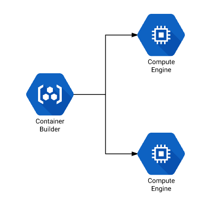

# Container Builder Remote Build Step

## THIS IS NOT AN OFFICIAL GOOGLE PRODUCT

## Intro

### What?



Some continuous integration workloads require special builder types. You may
require things like:

1. High CPU/Memory machines
1. Custom image
1. GPUs attached
1. Fast or large disks
1. Machines in a particular network
1. Pre-emptibility

In these cases you can leverage Container Builder to trigger your builds and
manage their workflow but run the actual build steps on an instance with
exactly the configuration you need.

### How?

When using the remote-builder image, the following will happen:

1. A temporary SSH key will be created in your Container Builder workspace
1. A instance will be launched with your configured flags
1. The workpace will be copied to the remote instance
1. Your command will be run inside that instance's workspace
1. The workspace will be copied back to your Container Builder workspace

## Usage

In order to use this step you can configure your build step as follows:

```
steps:
- name: gcr.io/cloud-solutions-images/remote-builder:v0.3.0
  env:
    - COMMAND=ls -la
```

This will launch an instance with the default parameters and then run the
command `ls -la` inside the instance's workspace.

## Configuration

The following options are configurable via environment variables passed to the
build step in the `env` parameter:

| Options       | Description   | Default |
| ------------- | ------------- | ------- |
| COMMAND | Command to run inside the remote workspace | None, must be set |
| USERNAME  | Username to use when logging into the instance via SSH  | `cloud-user` |
| REMOTE_WORKSPACE  | Location on remote host to use as workspace | `/home/${USERNAME}/workspace/` |
| INSTANCE_NAME  | Name of the instance that is launched  | `builder-$UUID` |
| ZONE  | Compute zone to launch the instance in | `us-central1-f` |
| INSTANCE_ARGS| Parameters to the instance creation command. For a full list run `gcloud compute instances create --help`| `--preemptible` |

## Quick Start

In the following example, you will run a script inside of containers on two instances in
parallel. You will use the Container Optimized OS image to provide an image with Docker
pre-installed. The build request runs the `test/no-op.sh` script from this directory.

1. Add the Cloud Build service account as a serviceAccountUser and instanceAdmin:

```shell
export PROJECT=$(gcloud info --format='value(config.project)')
export PROJECT_NUMBER=$(gcloud projects describe $PROJECT --format 'value(projectNumber)')
export CB_SA_EMAIL=$PROJECT_NUMBER@cloudbuild.gserviceaccount.com
gcloud services enable cloudbuild.googleapis.com
gcloud projects add-iam-policy-binding $PROJECT --member=serviceAccount:$CB_SA_EMAIL --role='roles/iam.serviceAccountUser' --role='roles/compute.instanceAdmin' --role='roles/iam.serviceAccountActor'
```

2. Create the build request:

```shell
cat > cloudbuild.yaml <<EOF
steps:
- name: gcr.io/cloud-solutions-images/remote-builder:v0.3.1
  waitFor: ["-"]
  env:
    # Use Container Optimized OS
    # https://cloud.google.com/container-optimized-os/docs/
    - INSTANCE_ARGS=--image-project cos-cloud --image-family cos-stable
    - USERNAME=cloud-user
    # Run a script from the local build context in a Docker container
    - COMMAND=docker run -v /home/cloud-user/workspace:/workspace ubuntu:16.04 bash -xe /workspace/test-scripts/no-op.sh
- name: gcr.io/cloud-solutions-images/remote-builder:v0.3.1
  waitFor: ["-"]
  env:
    # Use Container Optimized OS
    # https://cloud.google.com/container-optimized-os/docs/
    - INSTANCE_ARGS=--image-project cos-cloud --image-family cos-stable
    - USERNAME=cloud-user
    # Run a script from the local build context in a Docker container
    - COMMAND=docker run -v /home/cloud-user/workspace:/workspace ubuntu:16.04 bash -xe /workspace/test-scripts/no-op.sh
EOF
```

3. Submit the build with the local context as the workspace. 

```shell
gcloud container builds submit --config cloudbuild.yaml .
```

4. You should now see 2 instances being provisioned in parallel then the `test/no-op.sh` being
run inside containers based on the `ubuntu:16.04` Docker image.

## Trade-offs

1. Paying for builder + VM
1. Spin up time of VM increases build time
