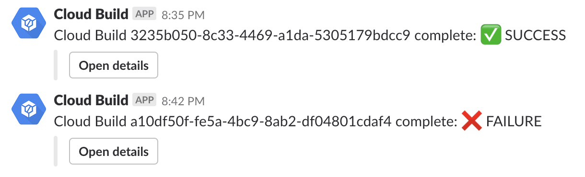

# slackbot

Slackbot allows you to post build status messages to Slack.



## Getting started

If you are new to Google Cloud Build, we recommend you start by visiting the [manage resources page](https://console.cloud.google.com/cloud-resource-manager) in the Cloud Console, [enable billing](https://cloud.google.com/billing/docs/how-to/modify-project), [enable the Cloud Build API](https://console.cloud.google.com/flows/enableapi?apiid=cloudbuild.googleapis.com), and [install the Cloud SDK](https://cloud.google.com/sdk/docs/).

Clone this repository and build the builder:
```sh
gcloud builds submit . --config=cloudbuild.yaml
```

Follow instructions on the Slack website to [create a bot for your workspace](https://get.slack.help/hc/en-us/articles/115005265703-Create-a-bot-for-your-workspace).  Copy and paste the webhook URL, you'll need it in a moment.  If you want a neat bot profile image, you can download and use the [official Cloud Build solution icon](https://cloud.google.com/icons/).  (Note Slack will ask you to resize it to 500 x 500 pixels first.)

## Using this tool

Add the builder as the first step in your project's `cloudbuild.yaml`: this triggers an independent "watcher" build which posts a status update whenever your main build completes - whether it's success or failure.

```yaml
steps:
- name: 'gcr.io/$PROJECT_ID/slackbot'
  args: [ '--build', '$BUILD_ID',
          '--webhook', '<Add your webhook URL here>' ]
...
```

## Examples

Examples showing both successful and unsuccessful builds are in the [examples](examples/) directory.

## Customization

You may wish to customize your build notifications and provide different information in the messages posted to Slack.  To do this, edit the JSON payload in [notify.go](slackbot/notify.go), following the [Slack message formatting guidelines](https://api.slack.com/docs/message-formatting).
